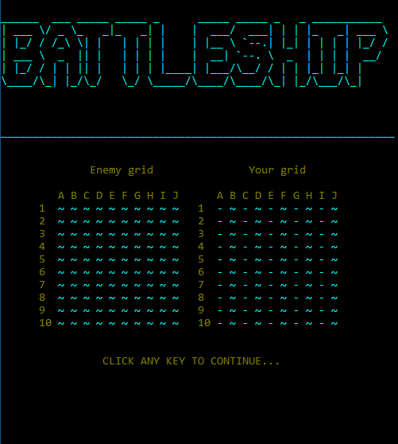
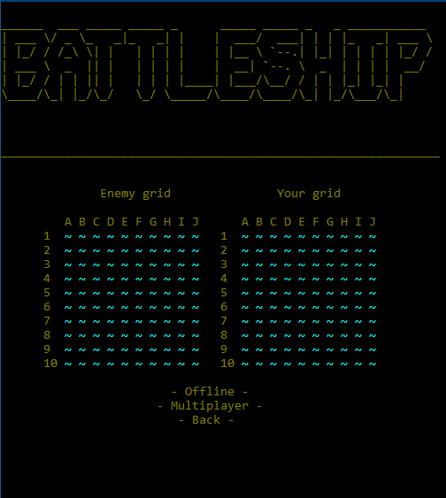
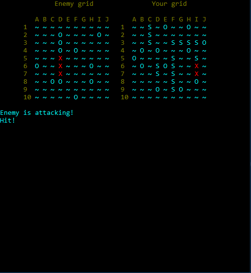
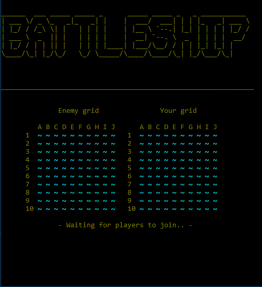
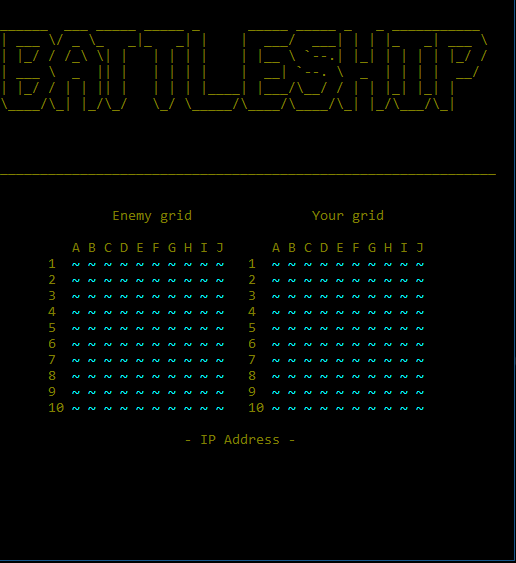
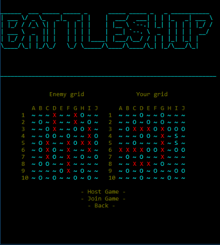

 

*The tides of war rage on..* !

C++ implementation of Battleships completely playable on the Window's commandline!
Playable offline and over LAN.

# Features
- Pixel by pixel crafted graphics with an animated intro

- Quick-use hotkey based menu (navigation by clicking the first letter of each option)

- Offline gameplay with automatic ship placement for quick play and animated gameplay dialog

- Play against a bot

- Multiplayer hosting as easy as clicking one key

- Join your friend's game by entering his IP

- Last game preview in your menus

# Prerequisites
ANSI escape code needs to be enabled on your console in order to process colors correctly otherwise game won't function properly.
