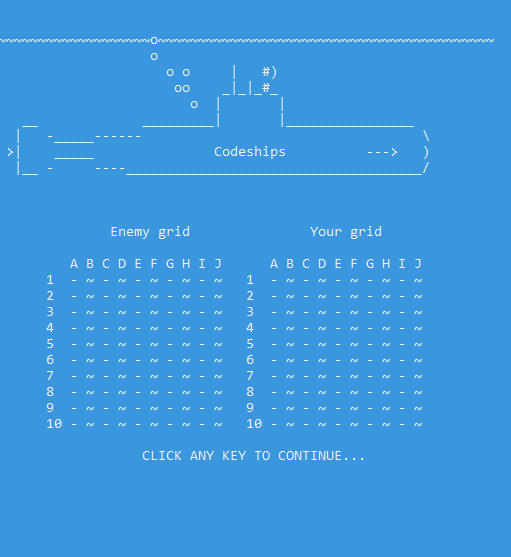

  
   
  <a href="https://github.com/Nizar1999/Codeships#features">Features</a>
   | 
  <a href="https://github.com/Nizar1999/Codeships#sample-gameplay">Gameplay</a>
   | 
  <a href="https://github.com/Nizar1999/Codeships#prerequisites">Prerequisites</a>
   | 
  <a href="https://github.com/Nizar1999/Codeships#acknowledgments">Acknowledgments</a>

# *The tides of war rage on..* !

C++ implementation of Battleships completely functional on the Window's commandline!

# Features
- Pixel Graphics Including an Animated Intro
- Quick-use Hotkey Based Menu
- Offline Gameplay Against Challenging Bots
- LAN Multiplayer

# Sample Gameplay

# Prerequisites
ANSI escape code needs to be enabled on your console in order to preview colors correctly.

Use Windows Console Host as Default Terminal Application for best results

# Acknowledgments
ASCII Submarine By Scott Mason
